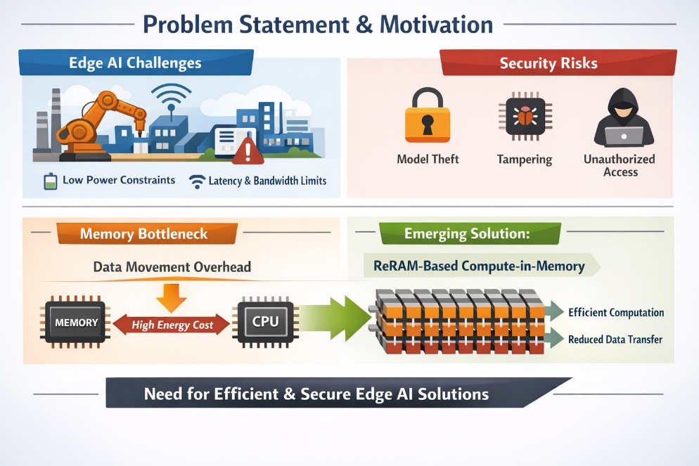
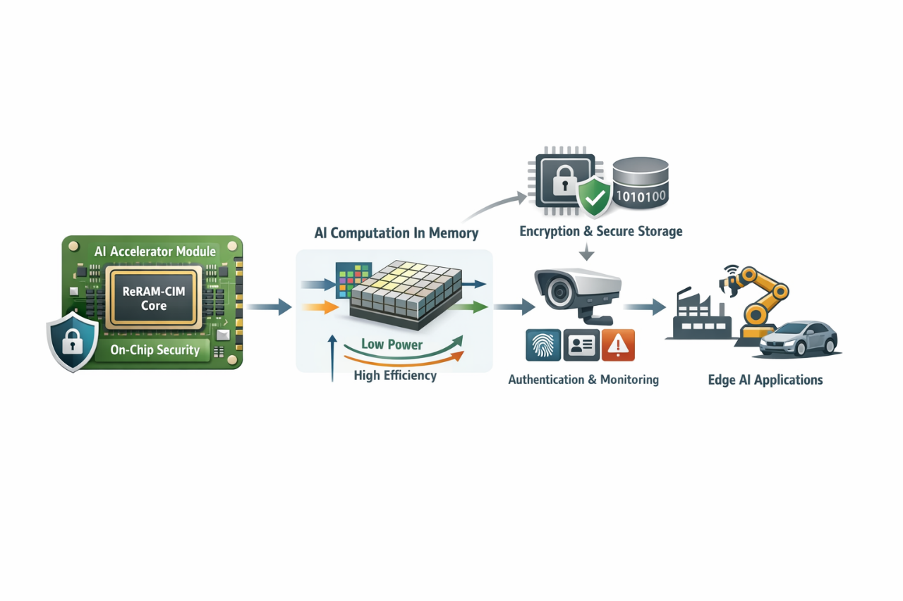

<b>Silicon to System: Solving Real-World Challenges</b>

The University of Arizona

  

Parsa Mirfasihi, Harish Kumar Dharavath, Muhtasim Alam Chowdhury, Dr. Soheil Salehi

Department of Electrical and Computer Engineering, University of Arizona, Tucson, AZ, USA

{parsamirfasihi, harrydhara, mmc7, ssalehi} @arziona.edu

---

<h2 align="center">Secure ReRAM-Inspired Compute-in-Memory Accelerator for Edge AI on Caravel SoC</h2>

**Abstract**: This project proposes a secure, energy-efficient edge-AI accelerator based on ReRAM inspired compute-in-memory (CIM) architecture implemented within the Caravel SoC framework. Traditional neural network accelerators suffer from **high energy consumption** due to frequent **data movement between memory and compute units**. To address this, our design emulates ReRAM crossbar-based CIM by performing matrix-vector operations within a tightly integrated memory-compute structure, significantly reducing data transfer overhead.

The system targets low-power industrial edge applications such as anomaly detection in sensor data. In addition to efficient inference, the design incorporates **hardware security features** including secure model loading, authenticated execution, and protected inference outputs. The accelerator will be implemented using the open-source SKY130 process and OpenLane flow, with full RTL, verification, and reproducible system integration including PCB and firmware support.

This project demonstrates a practical pathway toward future ReRAM-based AI hardware while delivering a fully open-source, production-oriented edge intelligence platform.

**Problem statement and motivation**: Edge AI systems in industrial and IoT environments are constrained by limited power, latency, and memory bandwidth. Frequent data movement between memory and compute units creates a major energy bottleneck, while deployed devices face risks such as model theft, tampering, and unauthorized access.

As shown in Fig. 1, ReRAM-inspired compute-in-memory (CIM) architectures address these challenges by performing computation directly within memory, reducing data transfer and improving efficiency, while enabling secure and trustworthy edge-AI systems.

  

<em>Figure 1. Edge AI Challenges, Memory Bottleneck, and ReRAM-CIM-Based Solution</em>

**Proposed Solution**: We propose a compact AI inference accelerator that implements a ReRAM-inspired compute-in-memory architecture within the Caravel user project area. The design emulates crossbar-based matrix-vector multiplication by tightly coupling weight storage and computation, reducing memory access overhead and improving energy efficiency.

The accelerator supports quantized neural network inference and is optimized for small-scale edge workloads such as anomaly detection and event classification. Unlike traditional accelerators, the proposed design incorporates CIM-style dataflow and models key non-idealities such as limited precision and variability.

In addition, the system integrates hardware security mechanisms to ensure trusted model execution and secure data handling, making it suitable for deployment in industrial and edge-IoT environments.

  

<em>Figure 2. Proposed ReRAM-CIM Accelerator with Integrated Security</em>

**System Architecture:**

**ReRAM-CIM Design Approach**: The accelerator implements a memory-centric datapath where weight storage and computation are co-located, enabling parallel matrix-vector operations without explicit weight movement. Weights are encoded as quantized conductance values and processed using a crossbar-inspired computation engine.

To maintain compatibility with the SKY130 digital flow, ReRAM behavior is abstracted through a synthesizable model that captures key effects such as finite precision and variability. The design supports tiled execution for scalability and integrates efficiently within the Caravel user project area.

**Hardware Security Integration:** The Hardware Security Integration of the proposed ReRAM-CIM accelerator is designed to protect deployed edge devices from vulnerabilities such as model theft, tampering, and unauthorized access. To ensure secure data handling and trusted model execution in industrial and edge-IoT environments, the system incorporates several key features:

•	Secure model loading: Protects the neural network models as they are loaded into the system.
•	Authenticated execution: Ensures that only authorized and verified models are run.
•	Protected inference outputs: Safeguards the results generated by the accelerator from interception or manipulation.

These security mechanisms are integrated alongside the computation units to enable a trustworthy edge-AI system. Furthermore, the functional correctness of these hardware security features, along with the control logic and matrix operations, is specifically validated during the RTL verification stage of the project.

**Implementation Plan**: The design will be implemented using the Caravel SoC harness and the OpenLane RTL-to-GDSII flow in the SKY130 process. The accelerator will be integrated as a user project macro and interfaced via the Wishbone bus.

The implementation will include:

- RTL design using Verilog
- Functional verification using testbenches and simulation tools (Icarus Verilog, Verilator)
- Physical design using OpenLane
- Precheck and tapeout validation on the ChipFoundry platform

Verification and Evaluation: The design will be verified at multiple levels:

- RTL Verification: Functional correctness of matrix operations, control logic, and security features.
- Gate-Level Simulation (GLS): Post-synthesis validation of timing and functionality.
- System Validation: End-to-end inference tests using real or synthetic datasets.

Performance metrics will include:

- inference latency
- energy efficiency (estimated)
- classification accuracy under quantization
- robustness to modeled variability
